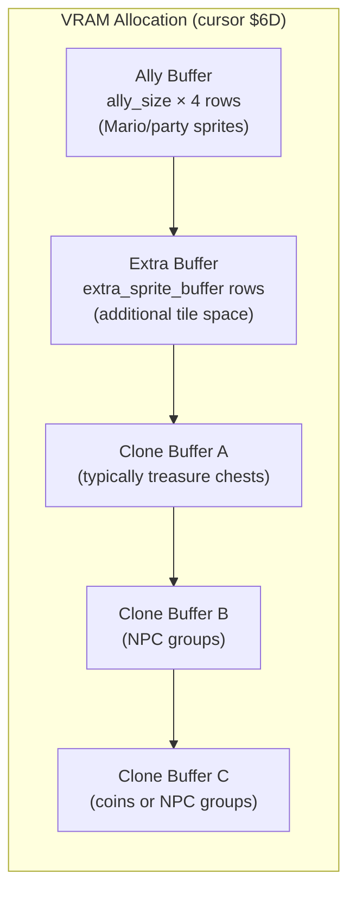

# SMRPG Overworld VRAM System — Complete Reference

> Reverse-engineered from ROM `smrpg.sfc` (SNES SA-1) by tracing assembly at `$C0:8FA0`, `$C0:90B0`, `$C0:8CDC`, `$C0:9ECB`, `$C0:E5E6`, `$C0:17A8`, `$C0:18D7`, `$C0:F5C0`, and the SA-1 coprocessor message protocol.

---

## Table of Contents

1. [Architecture Overview](#architecture-overview)
2. [Partition System](#partition-system)
3. [Buffer Types](#buffer-types)
4. [VramStore (Direction Types)](#vramstore-direction-types)
5. [NPC Properties](#npc-properties)
6. [Palette System](#palette-system)
7. [Effects NPC](#effects-npc)
8. [SA-1 Coprocessor DMA](#sa-1-coprocessor-dma)
9. [Battle VRAM](#battle-vram)
10. [Key ROM Addresses](#key-rom-addresses)
11. [Room-by-Room VRAM Analysis](#room-by-room-vram-analysis)

---

## Architecture Overview

SMRPG's overworld sprite system uses a **partition-based VRAM allocation** scheme. Each room references a partition entry that controls how VRAM is divided between:

- **Ally sprites** (the player character party)
- **Extra sprite buffer** (additional tile space)
- **Clone buffers** (shared tile pools for NPCs)

The system is managed by the **SNES CPU** (65816) with heavy delegation to the **SA-1 coprocessor** for DMA transfers.

### Memory Map

```
Object Memory Layout ($6000+):
  $6000-$605F  Mario (96 bytes)
  $6060-$60BF  Object 1 (party member 2)
  $60C0-$611F  Object 2 (party member 3)
  $6120-$629F  BG layer objects
  $62A0-$6D1F  28 NPC slots (96 bytes each)

VRAM Shadow (SA-1 BW-RAM):
  $40:4000-$7FFF  16KB sprite tile shadow

Partition Table:
  $1DDE00  Standard partition table (4 bytes per entry)
  $1DEBE0  Large partition table (alternate location)

NPC Property Table:
  $1DB800  7 bytes per NPC definition

Sprite GFX Pointers:
  $250000  Object GFX/Palette pointer table
```

### Cursor System

The partition loader uses a **linear cursor** (`$6D`) to track VRAM consumption. Each allocation unit = 1 row of 16 tiles (512 bytes of VRAM). The cursor advances as buffers are filled:


---

## Partition System

### Encoding (4 bytes per entry)

| Byte | Bits | Field | Description |
|------|------|-------|-------------|
| 0 | 7 | `full_palette_buffer` | 1 = 9 NPC palette slots, 0 = 5 slots (water mode) |
| 0 | 6-5 | `ally_buffer_size` | 0-3 → cursor units 0/4/8/12 (×4 for tile rows) |
| 0 | 4 | `extra_sprite_buffer` high bit | Combined with bits 3-0 |
| 0 | 3-0 | `extra_sprite_buffer` low bits | Total extra = bit4:bits3-0 (0-31 units) |
| 1 | 7-0 | Clone Buffer A | Buffer type byte |
| 2 | 7-0 | Clone Buffer B | Buffer type byte |
| 3 | 7-0 | Clone Buffer C | Buffer type byte |

### Loading Routine (`$C0:8FA0`)

```
1. Read partition index from room's NPC data (first byte)
2. Load 4-byte partition entry from table
3. Set palette buffer:
   - full_palette_buffer=1 → $01D2 = 9 (9 NPC palette rows)
   - full_palette_buffer=0 → $01D2 = 5, $01D3 = 1 (water flag)
4. Initialize cursor: $6D = ally_buffer_size × 4
5. Load ally sprites (5-7 consecutive sprite IDs per character)
6. Add extra_sprite_buffer to cursor
7. Process clone buffers A, B, C via $90B0
```

### Ally Sprite Loading (`$C0:9B4E`)

Character index → base sprite ID mapping (hardcoded):

| Character | Index | Base Sprite | Consecutive Sprites |
|-----------|-------|-------------|-------------------|
| Mario | 0 | 0 | 7 (sprites 0-6) |
| Peach | 1 | 7 | 6 (sprites 7-12) |
| Bowser | 2 | 13 | 6 (sprites 13-18) |
| Geno | 3 | 19 | 6 (sprites 19-24) |
| Mallow | 4 | 25 | 6 (sprites 25-30) |

The ally buffer size must accommodate the **maximum mold tile count** across all loaded sequences. The formula is:

```
min_vram_from_mold = ceil(max(0, truthy_subtiles - 16) / 16)
```

Where `truthy_subtiles` = number of non-empty 8×8 tiles in the mold. The baseline 16 subtiles are "free" (always available). Each additional unit = 16 more subtiles.

---

## Buffer Types

### Clone Buffer Processing (`$C0:90B0`)

Each clone buffer byte selects one of 8 types:

| Byte | Type | Description | Cursor Cost | Sprite(s) Loaded |
|------|------|-------------|-------------|-----------------|
| `$01` | FOUR_SPRITES_PER_ROW | 4 NPCs share VRAM row | config=1 | Dynamic |
| `$03` | THREE_SPRITES_PER_ROW | 3 NPCs share VRAM row | config=3 | Dynamic |
| `$5E` | TREASURE_CHEST | Treasure chest | +4 cursor units | Sprite $5E |
| `$5F` | EMPTY_TREASURE_CHEST | Opened chest | +4 cursor units | Sprite $5F |
| `$C0` | COINS_TYPE_1 | Coin animation set 1 | Variable | $C0, $C1, $C2, $CA |
| `$C1` | COINS_TYPE_2 | Coin animation set 2 | Variable | Similar |
| `$C2` | COINS_TYPE_3 | Coin animation set 3 | Variable | Similar |
| `$FF` | EMPTY | No allocation | 0 | None |

### Key Rules

- **Treasure chests MUST use clone buffer A** ($5E/$5F). The game hardcodes chest collision detection to check buffer A's NPC slot range.
- **Coins MUST use clone buffer C** ($C0/$C1/$C2). Coin spawn logic references buffer C's slot range.
- **Clone vs Dynamic NPCs**: NPCs with `cannot_clone` flag (byte3 bit7) get their own VRAM allocation instead of sharing a clone buffer row. These are called "dynamic" or "active VRAM" NPCs.

### Buffer Space Allocation

For `THREE_SPRITES_PER_ROW` (config $03):
- Allocates space for 3 NPCs per row
- Each NPC in the buffer shares tile data
- Main buffer cursor advances by the row's tile count

For `FOUR_SPRITES_PER_ROW` (config $01):
- Same as above but 4 NPCs per row
- More NPCs sharing means less VRAM per NPC

---

## VramStore (Direction Types)

The VramStore value (3 bits, 0-7) controls how sprite tiles are loaded/swapped when an NPC changes facing direction. It determines which animation sequences map to which directions and how much VRAM each direction change requires.

### Direction Mapping Table

SMRPG uses 8 directions (0-7). The VramStore type determines which sprite **sequence index** is used for each direction, and whether the sprite is **horizontally mirrored** (flag $80) to save VRAM.

**From `$C0:9ECB` — Initial Direction Setup:**

#### VramStore 0, 3 — 4-Directional (2 sequences + mirror)

| Direction | Sequence | Mirror | Notes |
|-----------|----------|--------|-------|
| 0 (NW) | 1 | Yes | Mirrored version of seq 1 |
| 1 (N) | 0 | Yes | Mirrored version of seq 0 |
| 2 (NE) | 0 | Yes | Mirrored version of seq 0 |
| 3 (E) | 0 | No | Primary forward/right |
| 4 (SE) | 0 | No | Same as E |
| 5 (S) | 1 | No | Primary down/left |
| 6 (SW) | 1 | No | Same as S |
| 7 (W) | 1 | Yes | Mirrored version of seq 1 |

**Unique sequences needed: 2** (seq 0 and seq 1)

#### VramStore 1 — 4-Directional + Extra (3 sequences)

Same as Type 0/3 except:
- **Direction 2 (NE)** → Sequence **$0A** (10), No mirror

**Unique sequences needed: 3** (seq 0, 1, $0A)

#### VramStore 2 — 2-Directional (1 sequence + mirror)

| Direction | Sequence | Mirror |
|-----------|----------|--------|
| 0-2, 7 | 0 | Yes |
| 3-6 | 0 | No |

**Unique sequences needed: 1** (seq 0 only)

#### VramStore 4, 5, 6, 7 — 8-Directional (5 sequences)

| Direction | Sequence | Mirror |
|-----------|----------|--------|
| 0 (NW) | $0C (12) | Yes |
| 1 (N) | 0 | Yes |
| 2 (NE) | $0A (10) | No |
| 3 (E) | 0 | No |
| 4 (SE) | $0C (12) | No |
| 5 (S) | 1 | No |
| 6 (SW) | $0B (11) | No |
| 7 (W) | 1 | Yes |

**Unique sequences needed: 5** (seq 0, 1, $0A, $0B, $0C)

### VramStore 7 — Special SA-1 DMA Path

In addition to the standard 8-directional mapping above, VramStore 7 has a **second direction handler** at `$C0:18D7` that runs during active movement. This uses the SA-1 coprocessor for tile DMA:

- Uses sequences 0-4 (positive Y) and 5-9 (negative Y)
- Up to **10 direction sequences** total
- Triggers SA-1 DMA via `$C0:F5C0` (command `$8D`)
- Sets global flag at `$00707C` bit 0

VramStore 7 is used for **Mario and ally characters** who need the most directional animation variety and fast VRAM updates.

### VRAM Size Calculations (`$C0:E5E6`)

Each VramStore type uses a different formula to calculate the VRAM offset needed for direction tile data, based on the sprite's tile count ($72):

| VramStore | Formula | Notes |
|-----------|---------|-------|
| 0, 1 | `($72 & $C0) >> 5 + 1` | Groups into 4 sizes: 1, 3, 5, 7 |
| 2, 4, 5, 6, 7 | `($72 + $10) >> 5` | Linear scale, offset $10 |
| 3 | `(($72 + $20) >> 5) & $FE` | Linear scale, offset $20, even only |

### Duplicate Values Explained

| VramStore | Behavior | Why Duplicates? |
|-----------|----------|-----------------|
| 0 | 4-dir, 2 seq | Standard NPC |
| 1 | 4-dir + extra NE | NPCs needing distinct NE facing |
| 2 | 2-dir, 1 seq | Symmetrical sprites (left/right only) |
| 3 | Same as 0 | Different VRAM size formula (even alignment) |
| 4 | 8-dir, 5 seq | Full directional NPC |
| 5 | Same as 4 | Unknown distinction (possibly palette-related) |
| 6 | Same as 4 | Unknown distinction |
| 7 | 8-dir + SA-1 DMA | Player characters, highest VRAM usage |

Types 4-6 appear identical in direction mapping but may have different behavior in the `$DA6E` handler (which specifically checks for types 4 and 7 for animation state management).

### Bit 3 — Cannot Clone Flag

Object+$59 bit 3 (`BIT #$08` checks at `$0FBB`, `$848E`) is the **cannot_clone** flag. When set, the NPC cannot share a clone buffer row and must have dedicated VRAM space. This is separate from the 3-bit VramStore value (bits 0-2).

---

## NPC Properties

### 7-Byte NPC Entry Format (`$1DB800`)

| Byte | Bits | Field |
|------|------|-------|
| 0 | 7-0 | Sprite ID |
| 1 | 7-5 | Unknown flags |
| 1 | 4-2 | VramStore (3 bits → stored to object+$59 bits 0-2) |
| 1 | 1-0 | VRAM size low bits |
| 2 | 7-0 | Event/behavior flags |
| 3 | 7 | Cannot Clone (1 = needs dedicated VRAM) |
| 3 | 6-0 | Additional properties |
| 4-6 | - | Event triggers, position data |

### VRAM Size at Object+$1A

```
object_vram_size = (configured_size + 1) × 4
```

This value is in the same cursor unit system as the partition's ally buffer. Each unit = 1 VRAM row = 16 tiles = 512 bytes.

### Sprite Table Management (`$C0:9C4A`)

The game maintains a sprite lookup table at `$0490` with 12-byte entries. `$0102` tracks the number of loaded sprites. When a new sprite is needed, the table is searched for an existing entry before allocating a new one. This allows multiple NPCs to reference the same sprite data without duplication.

---

## Palette System

### Palette Buffer Modes

| Mode | `full_palette_buffer` | NPC Palette Slots | Water Effect |
|------|----------------------|-------------------|-------------|
| Full | 1 | 9 | Disabled |
| Water | 0 | 5 | Enabled |

When `full_palette_buffer = 0`, the game reserves 4 palette rows for water/lava animation effects, leaving only 5 for NPC palettes.

### Palette Row Assignment

Each NPC references a palette row. Clone buffer NPCs sharing a row typically share a palette. Dynamic NPCs (cannot_clone) need their own palette slot.

---

## Effects NPC

The `effects_npc` field in a Room targets a specific NPC object slot index for applying visual effects (save point glow, waterfall, chandelier flash, etc.).

### Save Point NPC Shifting

When the ally buffer size increases (e.g., Bowser as protagonist requires +1), the NPC slot indices shift. The glowing save point effect must target the correct adjusted slot:

```python
# If ally_buffer_size increases, shift the save point target
buffer_increase = new_ally_buffer_size - old_ally_buffer_size
if buffer_increase > 0:
    new_npc_index = old_npc_index + buffer_increase
    room.set_effects_npc(GLOWING_SAVE_POINT_NPC_BYTES[new_npc_index])
```

### EffectsNpc Values

| Value | Name | Description |
|-------|------|-------------|
| $00 | NOTHING | No effect |
| $05 | WATERFALL | Waterfall animation |
| $07 | SAVE_POINT_NPC0 | Save point on NPC slot 0 |
| $0A | FLASHING_CHANDELIER | Chandelier flash |
| $0B | SAVE_POINT_NPC1 | Save point on NPC slot 1 |
| $0D | SAVE_POINT_NPC2 | Save point on NPC slot 2 |
| $0F | WATER_TUNNEL | Water tunnel effect |
| $10 | SAVE_POINT_NPC3 | Save point on NPC slot 3 |
| $19 | GLOWING_MAGMA | Magma glow effect |

---

## SA-1 Coprocessor DMA

### Communication Protocol

The SNES and SA-1 communicate through two mechanisms:

**1. Polling Loop (Normal Commands)**
- SNES writes command byte to I-RAM `$3000` (SA-1 address `$0000`)
- SA-1 main loop polls `$0000`, dispatches via jump table at `$C0:8376`
- Used for commands 1-45+ (general game operations)

**2. Message Register (Command $8D — Sprite DMA)**
- SNES writes `$8D` to register `$2209`
- SA-1 interrupt fires, wakes polling loop
- Parameter at I-RAM `$3050` (SA-1 `$0050`)
- Sub-parameter at I-RAM `$3051` (SA-1 `$0051`)
- Completion signaled via I-RAM `$304B`

### DMA Delegation (`$C0:F5C0`)

```
$F5C0: STA $50        ; Store parameter to I-RAM
$F5C2: STZ $4B        ; Clear completion flag
$F5C4: LDA $00317F    ; Poll SA-1 busy flag (I-RAM $017F)
$F5C8: BNE $F5C4      ; Spin-wait while SA-1 busy
$F5CA: LDA #$8D       ; Command $8D
$F5CC: STA $002209    ; Write to SA-1 message register
$F5D0: LDA $4B        ; Poll completion flag (I-RAM $004B)
$F5D2: BEQ $F5D0      ; Spin-wait for SA-1 completion
$F5D4: RTS
```

### When SA-1 DMA is Used

Only **VramStore 7** triggers SA-1 DMA for direction changes:

```
$17A8: LDA $59,X      ; Load VramStore
$17AA: AND #$07       ; Mask to 3 bits
$17AC: CMP #$07       ; Is it type 7?
$17AE: BNE $17D7      ; Skip if not type 7
; ... setup parameters ...
$17C0: JSR $F5C0      ; SA-1 DMA call
```

The sub-parameter (`$51`) is `$04` or `$6F` depending on direction state bit 4.

---

## Battle VRAM

### Battle Memory Layout

```
Battle VRAM Shadow: $40:4000-$7FFF (16KB)
Maximum per formation: 6 enemies
Monster palette limit: 3 distinct palettes
```

### Sprite Size Tiers

| Tier | Bytes | Typical Usage |
|------|-------|---------------|
| Small | 2048 | Goombas, basic enemies |
| Medium | 4096 | Standard enemies |
| Large | 6144 | Bosses, large enemies |
| Extra Large | 8192 | Major bosses |

### Randomizer Budget

```python
MAX_VRAM_SIZE = 8192  # Maximum bytes per enemy sprite
```

The randomizer shuffler (`enemies.py`) filters formation candidates by total VRAM consumption to ensure the combined sprite data fits within the 16KB shadow buffer.

### Palette Constraint

Each formation supports at most **3 distinct monster palettes**. Monsters sharing a palette can be placed together freely, but exceeding 3 unique palettes causes visual corruption.

---

## Key ROM Addresses

### Partition & Buffer System

| Address | Description |
|---------|-------------|
| `$C0:8B81` | Sprite mapping init — reads room NPC data, extracts partition index |
| `$C0:8FA0` | Partition loading — reads 4 bytes, sets up ally/extra/clone buffers |
| `$C0:90B0` | Clone buffer processing — handles all 8 buffer types |
| `$C0:8CDC` | NPC property loading — reads 7-byte entries from `$1DB800` |

### Sprite & VRAM Management

| Address | Description |
|---------|-------------|
| `$C0:9B4E` | Ally sprite loading — character → sprite ID mapping |
| `$C0:9BEE` | Sprite GFX pointer loader — reads from `$250000` table |
| `$C0:9C4A` | Sprite table manager — 12-byte entries at `$0490` |
| `$C0:9CCC` | Special sprite handling — IDs 91, 96, 128, 172 |
| `$C0:9D21` | VRAM tracking table — entries at `$01F0` |

### Direction & VramStore

| Address | Description |
|---------|-------------|
| `$C0:9ECB` | Full VramStore dispatch — direction→sequence for all 8 types |
| `$C0:E5E6` | VRAM offset calculator — size formula per VramStore type |
| `$C0:17A8` | Direction change handler — VramStore 7 SA-1 DMA trigger |
| `$C0:18D7` | VramStore 7 movement handler — 10-sequence direction system |
| `$C0:DA6E` | Animation state check — VramStore 4 and 7 specific |

### SA-1 Communication

| Address | Description |
|---------|-------------|
| `$C0:F5C0` | SA-1 DMA delegation — command `$8D` to register `$2209` |
| SA-1 `$C0:8167` | SA-1 main loop — polls I-RAM `$0000` for commands |
| SA-1 `$C0:80AB` | SA-1 IRQ handler — message interrupt handler |
| SA-1 `$C0:8362` | SA-1 message dispatch |
| SA-1 `$C0:8376` | SA-1 command jump table |

### Data Tables

| ROM Address | Description |
|-------------|-------------|
| `$1DDE00` | Partition table (4 bytes × N entries) |
| `$1DB800` | NPC property table (7 bytes × N entries) |
| `$250000` | Sprite GFX/Palette pointer table |

---

## Room Analysis Examples

### How to Analyze a Room's VRAM Layout

For any room, trace these steps:

1. **Find the partition index** from the room's NPC data (first byte)
2. **Decode the partition** (4 bytes → ally size, extra buffer, clone buffers)
3. **Calculate cursor progression:**

```
cursor = 0
cursor += ally_buffer_size × 4        ; Ally sprite VRAM
cursor += extra_sprite_buffer          ; Extra buffer
; Clone buffer A
cursor += buffer_A.main_buffer_space   ; (if not EMPTY)
; Clone buffer B
cursor += buffer_B.main_buffer_space
; Clone buffer C
cursor += buffer_C.main_buffer_space
```

4. **Map each NPC to its buffer:**
   - NPCs with `cannot_clone=0` → assigned to clone buffer by sprite sharing
   - NPCs with `cannot_clone=1` → get dedicated VRAM from buffer

5. **Check palette slots:**
   - `full_palette_buffer=1` → 9 NPC palettes available
   - `full_palette_buffer=0` → 5 NPC palettes + water effects

6. **Check effects_npc:** If the room uses a save point effect, verify the NPC slot index accounts for any ally buffer size changes.

### Cursor Layout Diagram



### Partition Auto-Calculation Feasibility

To auto-calculate optimal partitions, you would need to:

1. **Trace event scripts** for the room to find all NPCs that can appear
2. **Analyze each NPC's sprite** to determine:
   - VramStore type (direction sequences needed)
   - Maximum mold tile count across all used sequences
   - Whether it can be cloned or needs dedicated VRAM
3. **Group NPCs into clone buffers** based on shared sprites
4. **Calculate minimum ally buffer** from protagonist sprite molds
5. **Sum all VRAM requirements** and find the smallest partition that fits

This is feasible but requires comprehensive event script parsing, as NPCs can be dynamically created/destroyed by events.

---

## Room-by-Room VRAM Analysis

Detailed analysis of 16 representative rooms showing buffer assignment, VRAM consumption, and randomizer considerations.

**Legend:**
- `S` = standalone NPC (not a clone), `C` = clone
- `BP` = BattlePackNPC/Clone, `CH` = ChestNPC/Clone
- VramStore: `D0` = DIR0_SWSE_NWNE, `D2` = DIR2_SWSE, `D4` = DIR4_ALL_DIRECTIONS
- `mv` = min_vram_size, `nc` = cannot_clone

### Room 242 — Forest Maze Underground (All Tree Trunk Areas)

**Partition:** ally=1 | extra=none | A=TREASURE_CHEST B=FOUR_SPR C=FOUR_SPR | full_palette=True

| # | Type | NPC | VStore | mv | nc | Buffer |
|---|------|-----|--------|----|----|--------|
| 0 | S | TRAMPOLINE_JUMP | D2 | 1 | Y | — (D2 non-gridplane) |
| 1 | S | WIGGLER | D0 | 2 | Y | — (cannot_clone) |
| 2 | S | TREASURE_CHEST_2 | D2 | 1 | N | A (chest) |
| 3 | C | TREASURE_CHEST_2 | D2 | — | — | A (chest) |
| 4 | C | TREASURE_CHEST_2 | D2 | — | — | A (chest) |
| 5 | S/BP | AMANITA | D0 | 0 | N | B (4spr gridplane) |
| 6 | C/BP | AMANITA | D0 | — | — | B |
| 7 | C/BP | AMANITA | D0 | — | — | B |
| 8 | S/BP | BUZZER | D0 | 1 | N | C (4spr overflow) |
| 9 | C/BP | BUZZER | D0 | — | — | C |
| 10 | S | WHIRLPOOL_WATER_2 | D2 | 0 | N | — (D2 non-gridplane) |

**Extra actions:** SURPRISE_FRAME → requires shocked_loop + shocked_shadow ally sprites

**Analysis:** Dense room with 3 distinct buffer consumers. Chests fill buffer A; Amanitas and Buzzers split across B and C (both FOUR_SPR). Trampoline, Wiggler, and Whirlpool are standalone cannot_clone or non-gridplane objects that use their own VRAM allocation via min_vram. No extra buffer means no packet rendering for items — only EXP star level-up text would be affected.

**Randomizer concern:** If boss shuffle replaces Amanita/Buzzer with larger sprites (min_vram > 0), buffer B/C could overflow. The partition calculator dynamically adjusts buffer types based on shuffled sprite gridplane formats.

---

### Room 234 — Forest Maze Secret

**Partition:** ally=1 | extra=3 | A=TREASURE_CHEST B=FOUR_SPR C=EMPTY_3 | full_palette=True

| # | Type | NPC | VStore | mv | nc | Buffer |
|---|------|-----|--------|----|----|--------|
| 0 | S | TRAMPOLINE_JUMP | D2 | 1 | Y | — |
| 1 | S/CH | TREASURE_CHEST_2 | D2 | 1 | N | A |
| 2 | S/CH | TREASURE_CHEST_2 | D2 | 1 | N | A |
| 3 | S/CH | TREASURE_CHEST_2 | D2 | 1 | N | A |
| 4 | S/CH | TREASURE_CHEST_2 | D2 | 1 | N | A |
| 5 | S/CH | TREASURE_CHEST_2 | D2 | 1 | N | A |

**Analysis:** 5 clustered floating chests with a single trampoline. Extra buffer = 3 (largest in any room) to handle multiple simultaneous item packets when player opens chests rapidly. Listed in `CLOSE_CHEST_ROOMS` with extra_size=2 override. Buffer C is EMPTY — only 2 of 3 clone buffers are active.

**Randomizer concern:** Chest contents determine packet sprite needs. If chests contain coins, a COINS buffer may be needed (but this room has no coin buffer). The partition calculator handles this via chest content analysis.

---

### Room 204 — Mushroom Way Area 02

**Partition:** ally=1 | extra=none | A=TREASURE_CHEST B=FOUR_SPR C=EMPTY_3 | full_palette=True

| # | Type | NPC | VStore | mv | nc | Buffer |
|---|------|-----|--------|----|----|--------|
| 0 | S/CH | TREASURE_CHEST | D2 | 1 | N | A |
| 1 | C/CH | TREASURE_CHEST | D2 | — | — | A |
| 2 | S/BP | GOOMBA_2 | D0 | 0 | N | B |
| 3 | C/BP | GOOMBA_2 | D0 | — | — | B |
| 4 | S/BP | GOOMBA_2 | D0 | 0 | N | B |
| 5 | S/BP | GOOMBA_2 | D0 | 0 | N | B |
| 6 | C/BP | GOOMBA_2 | D0 | — | — | B |
| 7 | S | TOAD | D0 | 0 | N | B |
| 8 | S | SKY_TROOPA | D0 | 0 | N | B |
| 9 | S | SKY_TROOPA | D0 | 0 | N | B |
| 10 | S | ITEM_BAG | D2 | 0 | N | — |
| 11 | C | ITEM_BAG | D2 | — | — | — |

**Analysis:** Heavy room with 12 objects. Goombas, Toad, and Sky Troopas all share buffer B (FOUR_SPR). Item Bags are D2 non-gridplane so they bypass buffer assignment. Buffer C is EMPTY — room only uses 2 of 3 clone buffers.

**Randomizer concern:** Partition calculator calls `update_mushroom_kingdom_partitions()` — though that function handles Mushroom Kingdom rooms, not Mushroom Way. This room's Goomba battles are shuffleable; if replaced with 3SPR-format sprites, buffer B type must change to THREE_SPR.

---

### Room 205 — Mushroom Way Area 03 (Boss: Hammer Bro)

**Partition:** ally=1 | extra=none | A=EMPTY_3 B=THREE_SPR(512) C=EMPTY_3 | full_palette=True
**Special case:** Listed in `SPECIAL_CASE_ROOMS` (complicated spiney sequence)

| # | Type | NPC | VStore | mv | nc | Buffer |
|---|------|-----|--------|----|----|--------|
| 0 | S/BP | SPIKEY_2 | D0 | 0 | N | B (3spr) |
| 1-4 | C/BP | SPIKEY_2 | D0 | — | — | B |
| 5 | S | TOAD | D0 | 0 | N | B |
| 6 | S | LAKITU_2 | D0 | 2 | Y | — (cannot_clone) |
| 7 | S | HAMMER_BRO | D2 | 2 | Y | — (cannot_clone) |

**Analysis:** Only buffer B is active (THREE_SPR with 512 bytes extra main space). Spikeys (5 objects sharing buffer B) are dynamically spawned by event triggers. Lakitu (min_vram=2) and Hammer Bro (min_vram=2) are both cannot_clone standalones with large VRAM footprints — they use dedicated VRAM outside the buffer system.

Buffer B has `index_in_main_buffer=False` and `main_buffer_space=BYTES_512`, which is unusual — it means the buffer gets 512 extra bytes of main buffer space but is not indexed relative to the main buffer.

**Randomizer concern:** Boss shuffle target. Hammer Bro is the room boss — if replaced with a larger sprite, the cannot_clone flag ensures it gets its own dedicated VRAM allocation via min_vram. The SPECIAL_CASE status prevents the partition calculator from making standard adjustments.

---

### Room 27 — Sunken Ship Underwater (Large Bloober Room)

**Partition:** ally=1 | extra=1 | A=FOUR_SPR B=FOUR_SPR C=EMPTY_3 | **full_palette=False** (water mode)

| # | Type | NPC | VStore | mv | nc | Buffer |
|---|------|-----|--------|----|----|--------|
| 0 | S/BP | BLOOBER | D2 | 0 | N | A |
| 1 | S/BP | BLOOBER_2 | D2 | 0 | N | A |
| 2-3 | C/BP | BLOOBER_2 | D2 | — | — | A |
| 4 | S | WHIRLPOOL_WATER | D2 | 1 | Y | — (cannot_clone) |
| 5 | S | STATIC_FROG_COIN | D2 | 0 | N | — (D2 non-gridplane) |

**Extra actions:** SWIM, WHIRL → maps to basic SOUTH direction sprites

**Analysis:** **Water room** — `full_palette=False` halves available palette rows (4 instead of 8), reserving palette space for water layer effects. Extra buffer = 1 for swim/whirl packet effects. Bloobers fill buffer A; buffer B (FOUR_SPR) is allocated but unused by current NPCs — it's available for dynamically-spawned sprites.

The Whirlpool (min_vram=1, cannot_clone) uses dedicated VRAM. Frog Coin is a static D2 sprite with min_vram=0, taking minimal space.

**Randomizer concern:** `full_palette=False` severely limits palette diversity — only 4 palette rows for all NPCs. If boss shuffle puts a sprite here that needs a unique palette row, it could conflict. Water physics also change protagonist behavior (SWIM/WHIRL extra actions).

---

### Room 154 — Marrymore Chapel (During Booster)

**Partition:** ally=1 | extra=none | A=FOUR_SPR B=EMPTY_3 C=EMPTY_3 | full_palette=True

| # | Type | NPC | VStore | mv | nc | Buffer |
|---|------|-----|--------|----|----|--------|
| 0 | S | SNIFIT | D0 | 0 | N | A |
| 1-2 | C | SNIFIT | D0 | — | — | A |
| 3 | S | TORTE_2 | D0 | 1 | N | A |
| 4 | C | TORTE_2 | D0 | — | — | A |
| 5 | S | RING | D2 | 0 | N | — |
| 6 | C | SHOES | D2 | — | — | — |
| 7 | C | CROWN | D2 | — | — | — |
| 8 | C | BROOCH | D2 | — | — | — |
| 9 | S | BOOSTER | D0 | 0 | N | A |
| 10 | S | TOAD | D0 | 0 | N | A |
| 11 | S | BUNDT_OBJECT | D2 | 0 | Y | — (nc) |
| 12 | S | BUNDT_OBJECT_2 | D2 | 0 | Y | — (nc) |

**Analysis:** Only buffer A is active — all D0 gridplane NPCs (Snifits, Tortes, Booster, Toad) share it. Accessory items (Ring, Shoes, Crown, Brooch) are D2 non-gridplane tiny sprites. Bundt objects are cannot_clone with min_vram=0, meaning they use baseline VRAM only.

Buffers B and C are both EMPTY, meaning this room has very limited VRAM for NPC diversity — everything funnels through buffer A.

**Randomizer concern:** `update_chapel_partition()` dynamically sets buffer types for indices 0, 1, 2 based on shuffled NPCs at positions 0, 3, 7. This is critical because the vanilla room has 2 empty buffers — if shuffled bosses need different buffer types (THREE_SPR), those empty slots get activated.

---

### Room 470 — Factory Grounds 04 (Gun Yolks Room)

**Partition:** ally=1 | extra=none | A=EMPTY_3 B=THREE_SPR C=FOUR_SPR | full_palette=True

| # | Type | NPC | VStore | mv | nc | Buffer |
|---|------|-----|--------|----|----|--------|
| 0 | S | GUNYOLK_TOP | D2 | 0 | N | — |
| 1-3 | C | GUNYOLK_TOP | D2 | — | — | — |
| 4 | C | GUNYOLK_OUTER | D2 | — | — | — |
| 5-6 | C | GUNYOLK_TOP | D2 | — | — | — |
| 7 | S | DRILL_BIT | D0 | 0 | N | C (4spr) |
| 8-11 | C | DRILL_BIT | D0 | — | — | C |
| 12 | S | FACTORY_CHIEF | D0 | 0 | N | B (3spr) |
| 13 | S | FACTORY_CRANE | D2 | 1 | Y | — (nc) |
| 14 | S | GREEN_SWITCH | D2 | 0 | N | — |
| 15 | S | DRILL_BIT | D0 | 0 | N | C |

**Extra actions:** LEAN_BACK, LEAN_BACK_2, LEAN_BACK, CLIMB_FRAME
**Effects NPC:** UNKNOWN_1D

**Analysis:** 16 objects — near the engine's limit. Gun Yolk is assembled from 7 clone objects (6× top section + 1× outer section), all D2 non-gridplane. Drill Bits (5 total + 1 standalone) fill buffer C (FOUR_SPR). Factory Chief goes to buffer B (THREE_SPR). Factory Crane (cannot_clone, min_vram=1) uses dedicated space.

Buffer A is EMPTY despite the room being packed — Gun Yolk parts don't need a clone buffer because they're D2 non-gridplane sprites that each get individual VRAM slots.

---

### Room 281 — Moleville Mines 07 (From Croco's Bombed Room)

**Partition:** ally=1 | extra=none | A=THREE_SPR B=THREE_SPR C=FOUR_SPR(512) | full_palette=True

| # | Type | NPC | VStore | mv | nc | Buffer |
|---|------|-----|--------|----|----|--------|
| 0 | S | CROCO_OVERWORLD | D0 | 0 | N | A or B (3spr) |
| 1 | S/BP | MAGMITE | D0 | 1 | N | A or B (3spr) |
| 2 | C/BP | MAGMITE | D0 | — | — | A or B |
| 3 | S/BP | SPARKY | D2 | 0 | N | — |

**Analysis:** Compact room with only 4 objects. Two THREE_SPR buffers (A and B) handle the D0 gridplane NPCs (Croco, Magmites). Buffer C (FOUR_SPR with 512 extra bytes) is available for wider sprites. Sparky is D2 non-gridplane.

The partition calculator calls `update_mines_henchman_room_partitions()` which sets buffer 0 based on Croco's sprite — if Croco is shuffled to a wider sprite, buffer A type adjusts accordingly.

---

### Room 341 — Nimbus Land (Garro's House)

**Partition:** ally=1 | extra=none | A=FOUR_SPR B=THREE_SPR C=THREE_SPR | full_palette=True

| # | Type | NPC | VStore | mv | nc | Buffer |
|---|------|-----|--------|----|----|--------|
| 0 | S | NIMBUS_GUARD | D0 | 0 | N | A (4spr) |
| 1 | S | VALENTINA_STATUE | D0 | 0 | N | B (3spr) |
| 2-3 | C | VALENTINA_STATUE | D0 | — | — | B |
| 4 | S | MALLOW_STATUE | D2 | 0 | N | — |
| 5 | S | GOLD_GOOMBA_2 | D0 | 0 | Y | — (nc) |

**Analysis:** The statue game room. Valentina Statue fills buffer B with clones. Nimbus Guard goes to buffer A. Mallow Statue is D2 (non-gridplane). Gold Goomba is cannot_clone with its own slot.

**Randomizer concern:** `update_statue_room_partitions()` dynamically adjusts buffer 1 based on the Valentina Statue's actual sprite format after shuffling. This is one of many Nimbus Castle rooms that get dynamic partition updates.

---

### Room 190 — Mushroom Kingdom (During Mack, Outside)

**Partition:** ally=1 | extra=none | A=FOUR_SPR B=FOUR_SPR C=FOUR_SPR | full_palette=True

| # | Type | NPC | VStore | mv | nc | Buffer |
|---|------|-----|--------|----|----|--------|
| 0 | S | SHYSTER | D0 | 0 | N | A |
| 1-2 | C | SHYSTER | D0 | — | — | A |
| 3 | S/BP | SHYSTER | D0 | 0 | N | B |
| 4 | C/BP | SHYSTER | D0 | — | — | B |
| 5 | S | SHYSTER | D0 | 0 | N | B |
| 6 | S | SHYSTER | D0 | 0 | N | B |
| 7 | S | WALLET_GUY | D0 | 0 | N | C |
| 8 | C | RAINI | D0 | — | — | C |
| 9 | C | TOAD | D0 | — | — | C |
| 10 | S | EMPTY_3 | D2 | 0 | N | — |

**Analysis:** All three buffers are FOUR_SPR and actively used. Shysters dominate buffers A and B. Civilian NPCs (Wallet Guy, Raini, Toad) share buffer C. Empty NPC (#10) is a hitbox for the castle door.

**Randomizer concern:** `update_mushroom_kingdom_partitions()` updates buffers 0 and 1 based on NPC #0 (Shyster) and NPC #3 (battle Shyster). If the Mack henchmen are shuffled to different sprites, all three buffer types might need to change.

---

### Room 28 — Sunken Ship (Johnny's Room)

**Partition:** **ally=3** | extra=none | A=THREE_SPR B=EMPTY_3 C=EMPTY_3 | full_palette=True

| # | Type | NPC | VStore | mv | nc | Buffer |
|---|------|-----|--------|----|----|--------|
| 0 | S | JONATHAN_JONES_2 | D0 | 0 | N | A |
| 1 | S | BANDANA_BLUE | D0 | 1 | N | A |
| 2-4 | C | BANDANA_BLUE | D0 | — | — | A |
| 5 | S | EMPTY | D2 | 0 | N | — |
| 6 | S | EMPTY_3 | D2 | 0 | N | — |
| 7 | S | JJ_POSTGAME | D0 | 0 | N | A |

**Analysis:** **ally=3** — the largest ally buffer of any room in this set (3×4 = 12 VRAM rows for the protagonist). This is because the 1-on-1 duel with Johnny requires the full party sprite set. Only buffer A is active; buffers B and C are EMPTY.

Jonathan Jones and 4 Bandana Blues share buffer A. Bandana Blue has min_vram=1, meaning each standalone needs 1 extra VRAM row beyond baseline.

**Randomizer concern:** `update_johnny_room_partition()` adjusts buffers 0 and 1 based on shuffled NPCs at positions 0 and 1. The ally=3 setting is critical for the duel mechanic and should not be reduced.

---

### Room 362 — Volcano Area 07 (Stomping Corkpedite)

**Partition:** ally=1 | extra=allowed(0) | A=EMPTY_3 B=THREE_SPR C=EMPTY_3 | full_palette=True

| # | Type | NPC | VStore | mv | nc | Buffer |
|---|------|-----|--------|----|----|--------|
| 0 | S | CORKPEDITE | D2 | 3 | Y | — (nc) |
| 1 | S | OERLIKON | D0 | 0 | N | B |
| 2-4 | C | OERLIKON | D0 | — | — | B |

**Effects NPC:** GLOWING_MAGMA

**Analysis:** Corkpedite is the largest single-NPC VRAM consumer in this set: **min_vram=3** with cannot_clone=True. It's a D2 sprite that gets 3 dedicated VRAM rows (+ baseline). Oerlikons (projectile turrets) share buffer B.

Only buffer B is active — A and C are EMPTY. The extra buffer is allowed but size=0, meaning packets can be created but have minimal space.

---

### Room 435 — Ending Credits (Bowser's Keep Repair)

**Partition:** ally=1 | extra=none | A=THREE_SPR B=FOUR_SPR C=FOUR_SPR | full_palette=True

| # | Type | NPC | VStore | mv | nc | Buffer |
|---|------|-----|--------|----|----|--------|
| 0 | S | TERRAPIN_CREDITS | D0 | 0 | N | A or B |
| 1-2 | C | TERRAPIN_CREDITS | D0 | — | — | A or B |
| 3 | S | GOOMBA_2 | D0 | 0 | N | B or C |
| 4-5 | C | GOOMBA_2 | D0 | — | — | B or C |
| 6 | S | MAGIKOOPA | D0 | 1 | N | A |
| 7 | S | BOWSER_ENDING | D0 | 1 | Y | — (nc) |
| 8 | C | BOWSER_ENDING | D0 | — | — | — |
| 9 | S | SHYGUY_HELICOPTER | D2 | 0 | N | — |

**Analysis:** Credits scene with Bowser directing repairs. Bowser (min_vram=1, cannot_clone=True) gets dedicated VRAM. Magikoopa (min_vram=1) also needs extra space. Three buffer types (3SPR, 4SPR, 4SPR) accommodate the mix of sprite formats.

**Randomizer concern:** `update_credits_partitions()` adjusts buffer 1 based on Magikoopa's sprite format. Credits rooms are generally not boss-shuffled but NPC sprites may change.

---

### Room 383 — Volcano Area 10 (Jumping Pyrospheres)

**Partition:** ally=1 | extra=allowed(1) | A=EMPTY_3 B=EMPTY_3 C=EMPTY_3 | full_palette=True

| # | Type | NPC | VStore | mv | nc | Buffer |
|---|------|-----|--------|----|----|--------|
| 0 | S | EMPTY_3 | D2 | 0 | N | — |
| 1 | S/BP | SPARKY | D2 | 0 | N | — |
| 2-3 | C/BP | SPARKY | D2 | — | — | — |
| 4 | S | STATIC_FROG_COIN | D2 | 0 | N | — |

**Extra actions:** SURPRISE_FRAME
**Effects NPC:** GLOWING_MAGMA

**Analysis:** **All three buffers are EMPTY** — the most minimal partition in this set. Every NPC is D2 (non-gridplane), so no clone buffers are needed at all. Sparkys are D2 fire sprites that get individual VRAM slots. The extra buffer (size 1) supports the SURPRISE_FRAME animation packet.

This room proves that D2-only rooms can function with fully empty partitions — the engine handles D2 sprites via direct VRAM allocation without the buffer system.

---

### Room 34 — Yoster Isle

**Partition:** ally=1 | extra=none | A=FOUR_SPR B=FOUR_SPR C=FOUR_SPR | full_palette=True

| # | Type | NPC | VStore | mv | nc | Buffer |
|---|------|-----|--------|----|----|--------|
| 0 | S | YELLOW_YOSHI | D0 | 1 | N | A |
| 1 | C | YELLOW_YOSHI | D0 | — | — | A |
| 2 | S | YELLOW_YOSHI | D0 | 1 | N | A |
| 3 | S | YELLOW_YOSHI | D0 | 1 | N | A |
| 4 | C | YELLOW_YOSHI | D0 | — | — | A |
| 5 | S | YELLOW_YOSHI | D0 | 1 | N | A |
| 6 | S | WALLET_GUY | D0 | 0 | N | B |
| 7 | C | RAINI | D0 | — | — | B |
| 8 | S | TOAD | D0 | 0 | N | B |
| 9 | S | GREEN_YOSHI | **D4** | 1 | N | B |
| 10 | S | BOSHI | D0 | 0 | N | C |
| 11 | S | FAT_YOSHI_BABY | D2 | 0 | Y | — (nc) |
| 12 | S | GREEN_YOSHI_WALK | D0 | 0 | Y | — (nc) |
| 13 | S | GREEN_YOSHI_WALK | D0 | 0 | Y | — (nc) |
| 14 | S | EMPTY_3 | D2 | 0 | N | — |
| 15 | C | EMPTY_3 | D2 | — | — | — |
| 16 | S | EMPTY_3 | D2 | 0 | N | — |

**Extra actions:** YOSHI

**Analysis:** **Largest room in this set** — 17 objects using 10 distinct NPC types. All three FOUR_SPR buffers are active.

Buffer A is dominated by 6 Yellow Yoshis (4 standalone with min_vram=1 each = 4 extra rows). Buffer B holds civilian NPCs plus the notable **Green Yoshi (DIR4_ALL_DIRECTIONS)** — the only DIR4 sprite in this entire 16-room set. DIR4 sprites have 5 direction sequences (full 8-directional) and consume more VRAM than DIR0 (2 sequences). Buffer C has Boshi.

Three cannot_clone standalones (Fat Yoshi Baby, 2× Green Yoshi Walk) use dedicated VRAM. EMPTY_3 objects are invisible hitboxes (mailbox, goalpost).

**Randomizer concern:** No boss shuffle here, but the high object count and Yellow Yoshi min_vram=1 requirements mean this room is near VRAM capacity. Adding NPCs via events could overflow.

---

### Room 128 — Pipe Vault Area 07 (Chompweed Room)

**Partition:** ally=1 | extra=allowed(1) | A=TREASURE_CHEST B=FOUR_SPR C=COINS | full_palette=True

| # | Type | NPC | VStore | mv | nc | Buffer |
|---|------|-----|--------|----|----|--------|
| 0 | S/CH | TREASURE_CHEST | D2 | 1 | N | A (chest) |
| 1 | S/CH | TREASURE_CHEST | D2 | 1 | N | A (chest) |
| 2 | S | CHOMPWEED | D2 | 0 | N | — |
| 3-6 | C | CHOMPWEED | D2 | — | — | — |
| 7 | S | CHOMPWEED | D2 | 0 | N | — |
| 8 | S | SMALL_COIN | D2 | 1 | N | C (coin) |
| 9 | C | SMALL_COIN | D2 | — | — | C (coin) |
| 10 | S | YELLOW_BLOCK_3 | D2 | 0 | Y | — (nc) |
| 11 | S | YELLOW_BLOCK_3 | D2 | 0 | Y | — (nc) |
| 12 | S/BP | GOOMBA_3 | D0 | 0 | Y | — (nc) |
| 13 | C/BP | GOOMBA_3 | D0 | — | — | B |

**Analysis:** The only room in this set using all 3 specialized buffer types simultaneously: TREASURE_CHEST, FOUR_SPR, and COINS. This is the complete partition system in action:

- Buffer A (TREASURE_CHEST): 2 floating chests
- Buffer B (FOUR_SPR): Goomba battle clone (D0 gridplane)
- Buffer C (COINS): Small coins for block rewards

Chompweeds (6 objects, all D2) bypass the buffer system entirely. Yellow Blocks (cannot_clone) get dedicated space. Extra buffer (size 1) handles chest item packets.

This room is a textbook example of the partition system's design: each buffer type serves its specific purpose, with D2 sprites independently allocated.

---

### Cross-Room Patterns

**Buffer type distribution across 16 rooms:**
| Buffer Type | Count as A | Count as B | Count as C |
|-------------|-----------|-----------|-----------|
| TREASURE_CHEST | 3 | 0 | 0 |
| FOUR_SPRITES_PER_ROW | 6 | 6 | 6 |
| THREE_SPRITES_PER_ROW | 1 | 5 | 2 |
| COINS | 0 | 0 | 1 |
| EMPTY_3 | 6 | 5 | 7 |

**Key observations:**
1. **TREASURE_CHEST only appears in buffer A** — the engine requires chests in the first clone buffer
2. **COINS only appears in buffer C** — coin sprites must use the last clone buffer
3. **FOUR_SPR is evenly distributed** across all positions — it's the most flexible type
4. **EMPTY_3 is most common in C** — many rooms don't need a third buffer
5. **full_palette=False** only in Room 27 (underwater) — water rooms sacrifice palette for water layer rendering
6. **ally=3** only in Room 28 (Johnny duel) — most rooms use ally=1
7. **DIR4 (full 8-directional)** is rare — only Green Yoshi in Room 34 uses it
8. **max min_vram**: Corkpedite at 3, Lakitu/Bundt at 3, Wiggler/Hammer Bro/Lakitu_2 at 2
9. Rooms with **effects_npc** (lava/magma): 362, 383, 470 — these consume additional VRAM for the effects layer

---

## Open Questions

### Partially Resolved

- **Unused molds in a sprite**: Molds not referenced by any sequence in the current VramStore direction set do NOT consume VRAM. Only the sequences actually mapped to directions (based on VramStore type) are loaded.

- **Packet buffer**: Packets (visual effects like level-up text, flowers, etc.) use the Extra Sprite Buffer. If the buffer has size 0, packets may fail to render (becoming invisible, as seen in Room 242 with non-flower packets).

- **Empty buffers**: EMPTY (`$FF`) clone buffers allocate no cursor space and no NPC slots. They effectively disable that buffer position.

### Requires Further Investigation

- **SA-1 command $8D payload**: The exact tile transfer logic inside the SA-1 for sprite DMA has not been fully traced. The SA-1 reads parameters from I-RAM `$0050-$0051` and performs the VRAM tile copy, but the decompression/transfer algorithm is inside SA-1-side code.

- **VramStore 5 vs 6 distinction**: Both map identically to VramStore 4 in all traced routines. They may differ in untested code paths or be truly redundant.

- **8 unknown NPC checkboxes in Lazy Shell**: These likely correspond to flag bits in the 7-byte NPC entry that control behavior flags (event triggers, interaction modes, etc.) rather than VRAM allocation.

---

*Document generated from ROM disassembly, March 2026. Key routines verified against Lazy Shell editor source (`Partitions.cs`, `NPCProperties.cs`, `SpritePartitions.cs`) and SMRPG reference documentation.*
